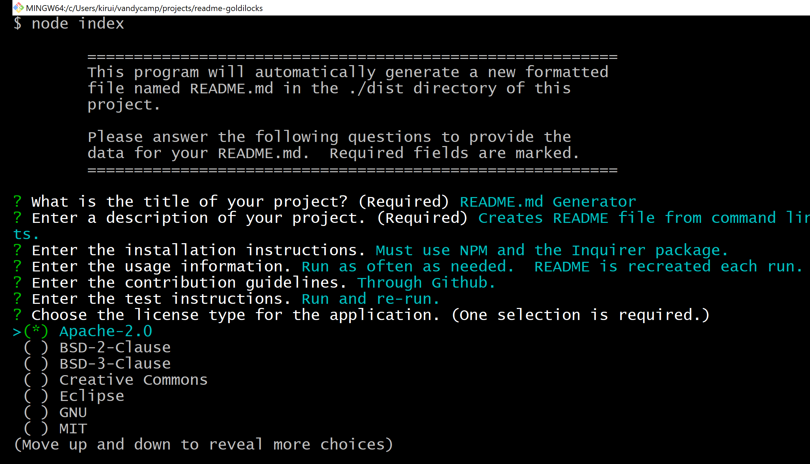
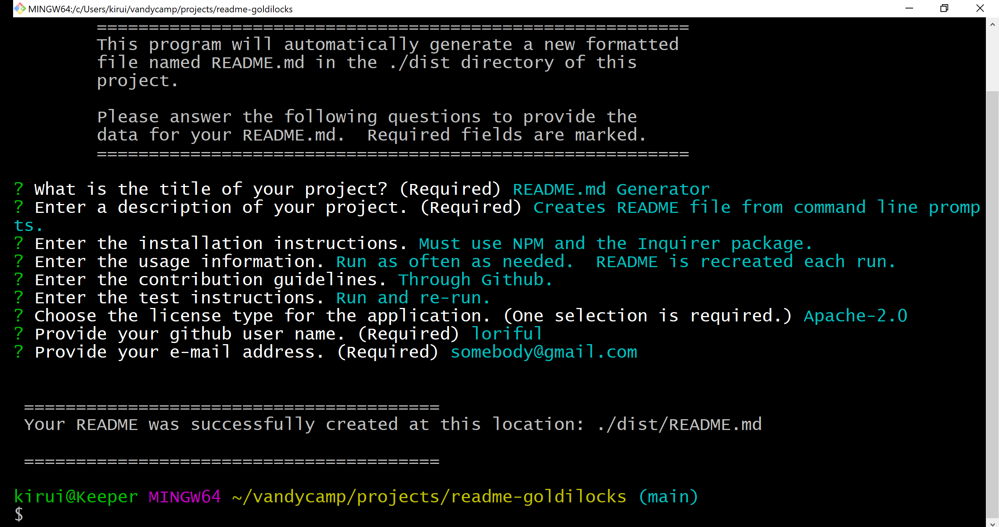

# **README Generator** 
## **Description**
  
- Command-line application that dynamically generates a professional README.md file from a user's input using the Inquirer package.
- Utilizes Javascript, Node, NPM, JSON, & Markdown 

<a href="https://watch.screencastify.com/v/ruQWHE5R3FCLwJ4r7Pz5" alt="Application Walk Through Video">**Walk Through Video**</a>
## **Table of Contents**
- [Description](#description)
- [Installation](#installation)
- [Usage](#usage)
- [Contributing](#contributing)
- [Tests](#tests)
- [Questions](#questions)
## **Installation**
- Requires NPM and the [Inquirer](https://www.npmjs.com/package/inquirer) package.  A "dist" directory is required at the root level to accept the automatically generated README.md file. 
## **Usage**
- Run the application from the command line using the command "node index".  Enter the required information at the prompts. Sample of completed run below.

 
 

 

  ## **Contributing**
  - Contribute via Github.
  ## **Tests**
  - Run the application as many times as required.  Each run replaces the current README in the "dist" directory.
  ## **Questions**
  ### Github Profile:  https://github.com/loriful
  
  ### You may contact tiptonica@gmail.com with any questions related to this repository.
  
  
  